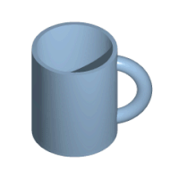
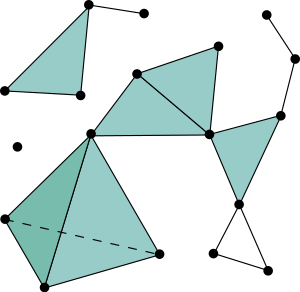
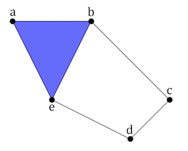
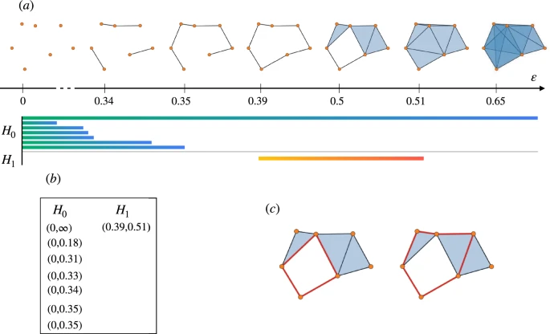

# matf-ml-2021-3D-shape-classification-using-persistent-homology

## Upustvo

```Bash
git clone git@github.com:spaske00/matf-ml-2021-3D-shape-classification-using-persistent-homology.git ml_marko_spasic_1014_2020
cd ml_marko_spasic_1014_2020/
python -m venv env
source env/bin/activate
pip install -r requirements.txt
tar xf data.tar.xz
jupyter notebook .
```

Marko Spasić 1014/2020


## Uvod u Perzistentnu homologiju

U ovom formatu podaci nisu pogodni za većinu algoritama mašinskog učenja. Kako bi podaci bili pogodni za većinu algoritama mašinskog učenja za klasifikaciju moraju biti u obliku matrice X. Svaka kolona ove matrice je neki
feature tog skupa podataka, a svaki red jedan uzorak iz tog skupa. Kako bi mogli da se primeni algoritmi nadgledanog učenja potrebno je da postoji i vektor labela y.

Kada bi svaki oblak tačaka iz skupa `point_clouds_basic` poredjali u jednu ovakvu matricu X, i u vektor y za
i-ti point cloud upisali kategoriju kojoj pripada, onda bi svaki red matrice X bio jedan point cloud.

Međutim, svaki point-cloud se sastoji od $n \in N$ tacaka gde je vaka tacka $x \in R^3$. To znači da bi svaki
point-cloud trebalo da bude jedna ćelija jednog reda ili da svaka tačka bude jedna ćelija (ali point-cloud-i ne moraju imati isti skup tačaka). U oba slučaja nije baš očigledno postaviti format. Drugi način bi možda bio
da napravimo X tako da ima tri kolone: X,Y,Z koordinatu, a onda da dodamo još jednu kolonu u kojoj bi pisalo
da li je to tačka sa kruga, torusa, sfere ili duplog torusa. To takođe nema smisla, jer šta znači da neke
3 koordinate pripadaju sfere? Sfera može biti definisana sa bilo kojojm tačkom. Ne zanima nas da li jedna pojedinačna tačka pripada nekom obliku, već da li ceo skup tačaka formira (nama na pogled) neki oblik koji ima
neke matematičke osobine.

Upravo se topologija bavi izučavanjem oblika i njihovih osobina. Topološko svojstvo ili topološka invarijanta je svojstvo topološkog prostora pod homeomorfizmom. Neformalno, ako zamislimo da je neki oblik (prostor) napravljen
od neke rastegljive gume, homeomorfizam rasteže, skuplja, gnječi...samo ako postoji rupa u toj gumi, ne sme da je popuni i ne sme da napravi novu rupu.



Jedna od glavnih invarijanti koje topologija izučava su upravo ove rupe. Upravo tu topološku osobinu možemo iskoristiti kao nosioca neke informacije o podacima. Ostaje pitanje: kako je definisati tako da može da se predstavi i izračuna pomoću računara?

Za izvlačenje topoloških osobina oblaka tačaka koristićemo tzv. dijagrame perzistencije, ali kako bi smo stigli do dijagrama perzistencije i njegovog značenja moramo početi od osnovnih objekata ove oblasti matematike.

### Simplicijalni kompleks
https://brickisland.net/DDGSpring2016/2016/01/14/reading-1-the-simplicial-complex/

Simplicijalni kompleks je skup simpleksa koji zadovoljavaju određena matematička svojstva. Simpleks je generalizovan pojam trougla u proizvoljno dimenzija. Obično se naziva k-simpleks gde je k broj dimenzija simpleksa. Na primer:  
0-simpleks je tačka  
1-simpleks je duž  
2-simpleks je trougao (popunjena unutrašnjost)  
3-simpleks je tetrahedron (popunjena unutrašnjost itd)  
4-simpleks ...


<figure>
        
        <div align="center">Simplicijalni kompleks https://en.wikipedia.org/wiki/Simplicial_complex</div>
</figure>


Već možemo da uočimo da ovakav simplicijalni kompleks ima neke topološke osobine. Na primer simplicijalni kompleks koji sadrži dva 0-simpleksa ima dve komponente povezanosti. Simplicijalni kompleks koji sadrži 3 1-simpleksa takvih da formiraju trougao ima jednu komponentu povezanosti i jednu dvo-dimenzionu rupu (praznina u trouglu)...

Simplicijalni kompleksi su definisani na takav način da se ove topološke osobine (komponenti povezanosti, rupe...) mogu izračunati pomoću računara.

$$ X = \{a, b, c, d, e, \{a,b\}, \{b,c\}, \{c,d\}, \{d,e\}, \{b,e\}, \{a,e\}, \{a,b,e\}\} $$

<figure>
        
        <div align="center">2-kompleks https://arxiv.org/abs/1904.11044</div>
</figure>

Računar može izračunati topološke osobine simplicijalnog kompleksa. Između ostalog možemo izračunati brojeve: povezanih komponenti, 1D rupa (kružnica i cilindar), 2D rupa (sfera) ...Ove vrednosti nazivaju se [Betijevi brojevi](https://en.wikipedia.org/wiki/Betti_number)
Neformalno, k-ti Betijev broj određuje broj k-dimenzionih rupa u topološkom prostoru.  Prva 3 Betijeva broja imaju sledeće značenje:  
$b0$ je broj povezanih komponenti  
$b1$ je broj jedno-dimenzionih rupa   
$b2$ je broj dvo-dimenzionih rupa (praznina)  

Na primer, za simplicijalni kompleks sa slike, Betijevi brojevi su:  
$b0 = 3$ broj povezanih komponenti  
$b1 = 1$ broj jedno-dimenzionih rupa  
$b2 = 1|0$  broj praznina  

Kakve ovo ima veze sa oblakom tačaka? Pa od oblaka tačaka možemo konstruisati abstraktni simplicijalni kompleks. Postoji više načina za konstrukciju simplicijalnog kompleksa od oblaka tačaka:  
1. [Vietoris-Rips kompleks](https://en.wikipedia.org/wiki/Vietoris%E2%80%93Rips_complex)
2. [Čehov kompleks](https://en.wikipedia.org/wiki/%C4%8Cech_complex)
3. [Kompleks svedoka](https://gudhi.inria.fr/doc/latest/group__witness__complex.html)
4. [Delone kompleks](https://courses.cs.duke.edu/fall06/cps296.1/Lectures/sec-III-3.pdf)
5. [Alpha compleks](https://gudhi.inria.fr/doc/latest/group__alpha__complex.html)
...

Za ovaj projekat koristićemo Vietoris-Rips kompleks (u nastavku Ripsov kompleks). Ripsov kompleks se konstruiše tako
što se oko svake tačke u skupu opiše kružnica prečnika $d$. Za svaku k-torku čije se kružnice međusobno seku doda se odgovarajući k-kompleks u simplicijalni kompleks tog skupa tačaka. 

<div align='center'>
<video width="80%" controls src="videos/rips_construction.mp4"/>
</div>
<center>
    [Mathew Wright - Introduction to Persistent homology](https://www.youtube.com/watch?v=h0bnG1Wavag)
</center>

Glavno pitanje je koja vrednost za $d$ je pogodna. Ukoliko je vrednost preniska ili previsoka, konstruisan Ripsov
kompleks neće nositi značajne informacije. Zbog toga se razmatraju sve $d\in\{0, R\}$ gde je R dovoljno veliko tako da se sve kružnice međusobno seku.

<figure>
        
        <div align="center">Ripsovi kompleksi</div>
</figure>

Postoje alogritmi i strukture podataka koje određuju tačno na kojim vrednostima $d$ dolazi do promene simplicijalnog kompleksa i samo u tim vrednostima se računaju željene topološke osobine jer za sve druge vrednosti ostaju iste. 

Izračunavanjem Betijevih brojeva za sve ključne vrednosti $d$ možemo da pratimo koje topološke osobine ostaju, odnosno perzistiraju. Na pojmu Homologije se nećemo zadržavati jer prevazilazi okvire i potrebe ovog rada. 


Kada kažemo da se neka komponenta $H_{i}$ rodila to znači da se odgavarajući Betijev broj $b_{i}$ povećao za jedan. Kada kažemo da je neka komponenta $H_{i}$ nestala (umrla) tada se odgovarajući Betijev broj smanjio $b_{i}$ za jedan. 

Ono što nas zanima su upravo one komponente koje najduže perzistiraju kroz povećavanje
prečnika sfere kojim se formira niz Ripsovih kompleksa u kojima i posmatramo promene ovih
komponenti.

Stvaranje i nestajanje ovih komponenti može se predstaviti **dijagramom perzistencije**.

<figure>
        
        <div align="center">Dijagram perzistencije https://www.nature.com/articles/s41598-021-84486-1</div>
</figure>

Opštije, N-ti Betijev broj označava rang n-te homološke grupe $H_{n}$. (Više na [linku](https://en.wikipedia.org/wiki/Persistent_homology)).

